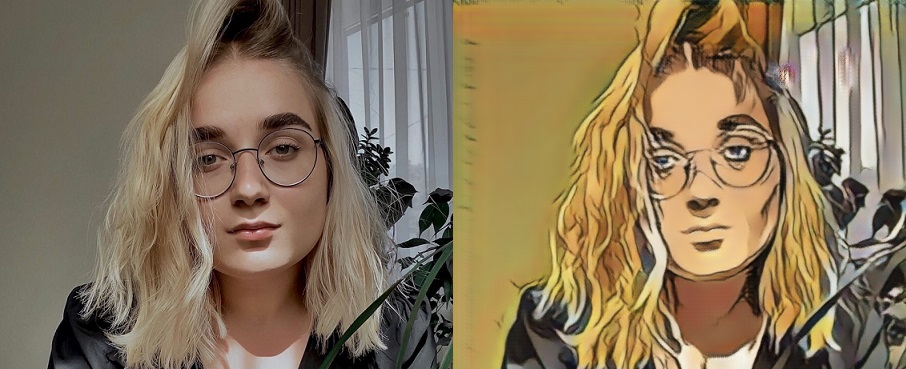
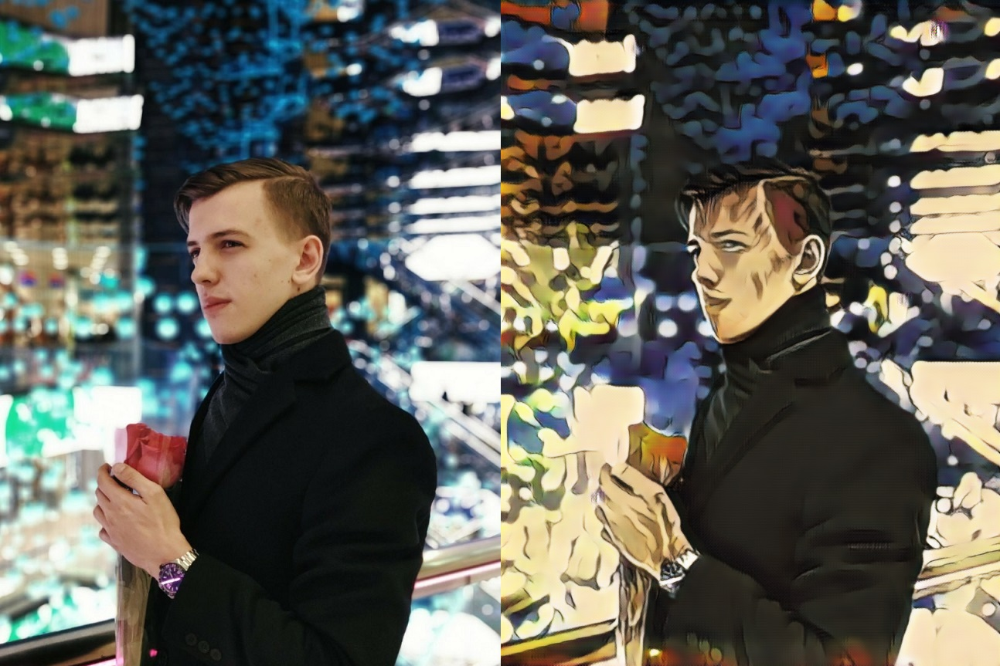
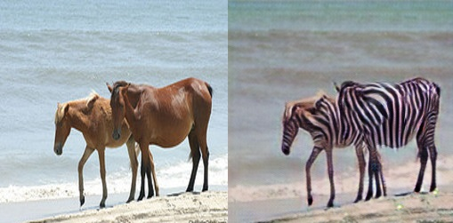
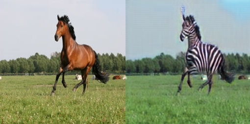

Примечание: все коммиты после 17 января (дедлайн) не относятся к коду

# Введение

Выбранная задача - перенос на фотографии стиля изображений персонажей аниме JoJo's Bizarre Adventure с помощью [CycleGAN](https://arxiv.org/pdf/1703.10593.pdf).
Перед выполнением основной задачи была в некотором виде выполнена задача междоменного переноса horse to zebra.

# Ссылки для загрузки используемых датасетов:

real2jojo:  https://drive.google.com/file/d/1QFkfPHuNCsmawMGlIJq25nzPw_8cAVuu/view?usp=sharing  
horse2zebra:  https://drive.google.com/file/d/14bQL2UXktCFBWUyfcUk0MsLfvueVcki7/view?usp=sharing  

# Ссылки на обученные веса:  

real2jojo: https://drive.google.com/file/d/1tBjpxKZI_gvt91l4OFvSc33L6bTXzOt5/view?usp=sharing  
horse2zebra: https://drive.google.com/file/d/1vf6JZrgvWmE7rEWl0IZtxvRw6Le6XJOO/view?usp=sharing  

# Параметры:

используемая модель - packages.models.CycleGAN  

#### Real to Jojo
для модели - lambd = 2, dropout = 0.5, прочие - по умолчанию;  
lr = 0.0002, оптимизатор - Adam;  
200 эпох  

#### Horse to zebra:  
для модели - resnet_layers = 6, dim_gen = 32, прочие - по умолчанию;  
lr = 0.0002,  оптимизатор - Adam;  
100 эпох

# Примеры генерации на тестовых данных:

1-е изображение - сгенерированное, 2-е - подаваемое на вход
#### Real to Jojo  

#### Horse to zebra  

Больше примеров - в папке results
